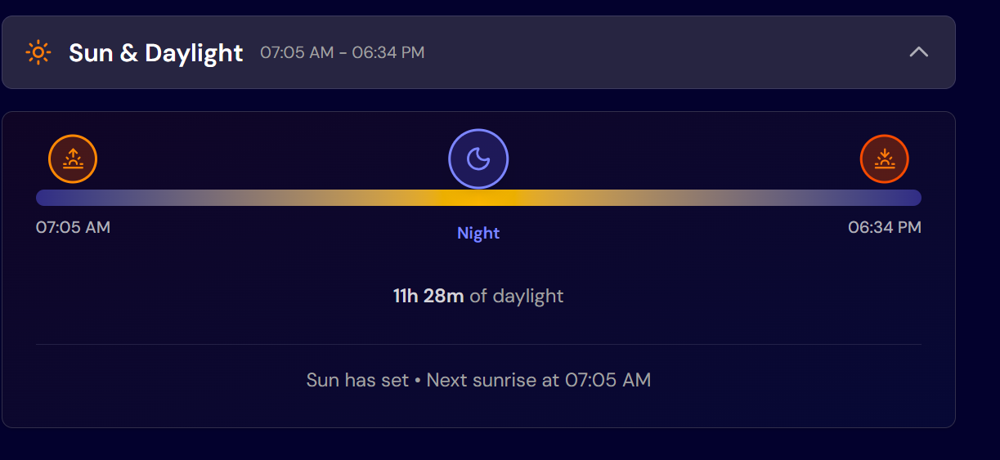

# Weather App - Open-Meteo Integration


## Overview

A modern, responsive weather application built with React, TypeScript, and Vite. This app provides real-time weather information using the Open-Meteo API, featuring current conditions, 7-day forecasts, and hourly temperature data with a beautiful, intuitive interface.

## 🆕 What's New (Stage 2)

- **One-Click Geolocation** - Instantly get weather for your current location
- **Extended Weather Metrics** - UV index, visibility, air pressure, wind gusts, and cloud cover
- **Smart Day Selection** - All metrics automatically update when you select different days
- **Collapsible Design** - Extended metrics section toggles for a cleaner UI
- **Enhanced API Integration** - Expanded daily forecast variables for richer data

## Features

### Core Functionality (Stage 1) ✅
- **Location Search**: Smart search with autocomplete suggestions for cities worldwide
- **Geolocation**: One-click "Use My Location" for instant local weather
- **Current Weather**: Real-time temperature, weather conditions, and location details
- **Weather Metrics**: Comprehensive data including:
  - "Feels like" temperature
  - Humidity percentage
  - Wind speed and direction
  - Precipitation amounts
- **7-Day Forecast**: Daily high/low temperatures with weather icons
- **Hourly Forecast**: 24-hour temperature timeline with day selector
- **Dynamic Metrics**: All metrics update when selecting different days
- **Unit Conversion**: Toggle between Imperial and Metric units
  - Temperature: Celsius/Fahrenheit
  - Wind Speed: km/h, mph
  - Precipitation: mm, inches
- **Recent Searches**: Quick access to previously searched locations
- **Responsive Design**: Optimized for mobile, tablet, and desktop devices

### Enhanced Features (Stage 2) ✅
- **Extended Metrics** (Collapsible):
  - UV Index with color-coded levels and health recommendations
  - Visibility in km/miles with quality descriptions
  - Air pressure in hPa/inHg
  - Wind gusts maximum speed
  - Cloud cover percentage with descriptions
- **Day-Aware Data**: Metrics automatically show forecast data for selected future days
- **Browser Geolocation**: Automatic location detection with permission handling

## Tech Stack

### Frontend Framework
- **React 19** - UI library
- **TypeScript** - Type safety and better developer experience
- **Vite** - Build tool and development server

### State Management & Data Fetching
- **Zustand** - Lightweight state management with persistence
- **React Query (TanStack Query)** - Server state management and caching
- **Axios** - HTTP client for API requests

### Styling & UI
- **Tailwind CSS v4** - Utility-first CSS framework
- **Radix UI** - Accessible component primitives
- **Custom UI Components** - Built with shadcn/ui patterns

### API Integration
- **Open-Meteo API** - Free weather data API
  - Weather forecasts
  - Geocoding for location search
  - No API key required

### Development Tools
- **ESLint** - Code linting
- **TypeScript** - Static type checking
- **PostCSS** - CSS processing

## Getting Started

### Prerequisites
- Node.js (v18 or higher)
- npm or yarn package manager

### Installation

1. Clone the repository:
```bash
git clone [repository-url]
cd weather-app-main
```

2. Install dependencies:
```bash
npm install
```

3. Start the development server:
```bash
npm run dev
```

4. Open your browser and navigate to:
```
http://localhost:5173
```

### Available Scripts

- `npm run dev` - Start development server
- `npm run build` - Build for production
- `npm run lint` - Run ESLint
- `npm run preview` - Preview production build locally

## Project Structure

```
src/
├── components/
│   ├── layout/         # Layout components (Header, Layout, UnitDropdown)
│   ├── states/         # State components (Loading, Error, Empty)
│   ├── ui/             # Reusable UI components
│   └── weather/        # Weather-specific components
├── hooks/              # Custom React hooks
├── lib/
│   ├── api/            # API client and services
│   ├── constants/      # App constants
│   └── utils/          # Utility functions
├── stores/             # Zustand store definitions
├── types/              # TypeScript type definitions
├── App.tsx             # Main app component
└── main.tsx           # App entry point
```

## Key Components

### Weather Dashboard
The main dashboard displays all weather information in a responsive grid layout:
- Current weather card with live temperature
- Weather metrics grid (feels like, humidity, wind, precipitation)
- 7-day forecast cards
- Hourly temperature timeline

### Search System
- Debounced search input for performance
- Autocomplete suggestions from Open-Meteo geocoding API
- Keyboard navigation support
- Recent searches stored in localStorage

### State Management
- **Zustand Store** manages:
  - User preferences (units)
  - Current location
  - Recent locations
  - UI state (selected day, transitions)
- **React Query** handles:
  - API data fetching
  - Caching strategies
  - Loading and error states

## API Integration

### Open-Meteo Endpoints Used
1. **Geocoding API** - Location search and autocomplete
   - Endpoint: `https://geocoding-api.open-meteo.com/v1/search`

2. **Weather Forecast API** - Weather data
   - Endpoint: `https://api.open-meteo.com/v1/forecast`
   - Current weather variables
   - Hourly forecast data
   - Daily forecast data

### Data Caching
- React Query implements smart caching
- Weather data cached for 5 minutes
- Location searches cached for session

## Responsive Design

### Breakpoints
- **Mobile**: 375px and up
- **Tablet**: 768px and up
- **Desktop**: 1440px and up

### Mobile Optimizations
- Touch-friendly interface
- Collapsible sections
- Optimized font sizes
- Horizontal scrolling for forecast cards

## Performance Optimizations

- **Code Splitting**: Lazy loading of components
- **Debounced Search**: Reduces API calls
- **Data Caching**: Minimizes redundant requests
- **Optimized Images**: Weather icons as inline SVGs
- **CSS Optimization**: Tailwind CSS purging unused styles

## Browser Support

- Chrome (last 2 versions)
- Firefox (last 2 versions)
- Safari (last 2 versions)
- Edge (last 2 versions)

## Known Issues

- No test coverage yet implemented
- Accessibility could be enhanced (ARIA labels, screen reader support)
- TypeScript strict mode could be enhanced

## Completed Enhancements (Stage 2)

- ✅ Geolocation detection for automatic current location
- ✅ Extended weather metrics (UV index, visibility, air pressure, wind gusts, cloud cover)
- ✅ Dynamic day-aware metrics (metrics update per selected day)
- ✅ Collapsible extended metrics section

## Planned Future Enhancements

- Sunrise/sunset times with visual indicators
- Favorites/saved locations system
- Compare weather between multiple locations
- Dark/light mode themes
- Progressive Web App (PWA) capabilities
- Weather animations based on conditions
- Voice search functionality

## Contributing

1. Fork the repository
2. Create your feature branch (`git checkout -b feature/amazing-feature`)
3. Commit your changes (`git commit -m 'Add amazing feature'`)
4. Push to the branch (`git push origin feature/amazing-feature`)
5. Open a Pull Request

## License

This project is part of a Frontend Mentor challenge and is for educational purposes.

## Acknowledgments

- [Open-Meteo](https://open-meteo.com/) for the free weather API
- [Frontend Mentor](https://www.frontendmentor.io/) for the design challenge
- [shadcn/ui](https://ui.shadcn.com/) for UI component patterns
- Weather icons and design assets from the challenge resources



